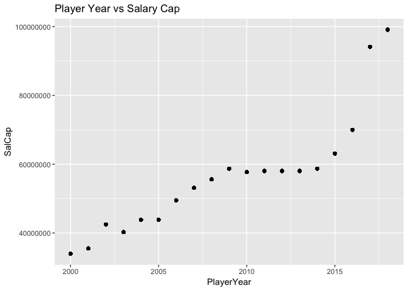
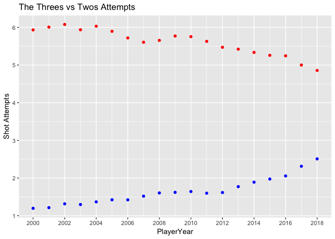
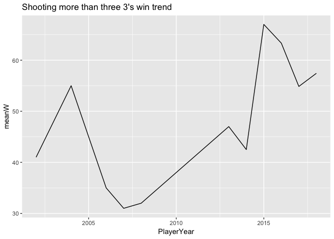
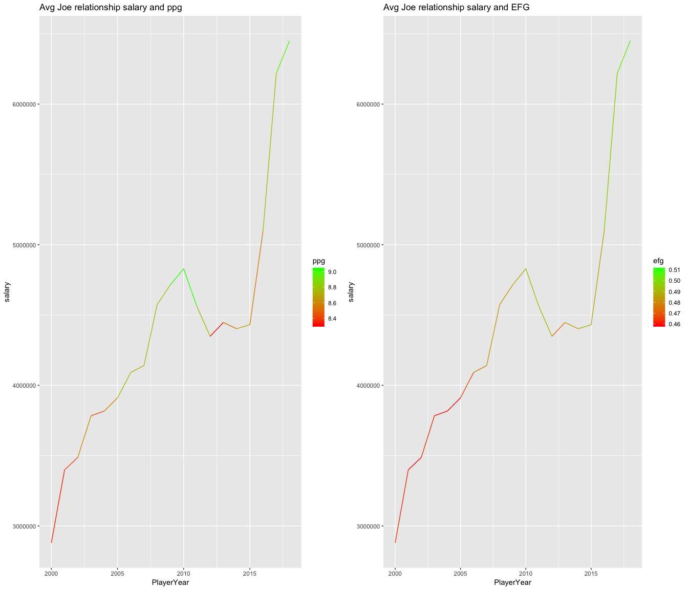
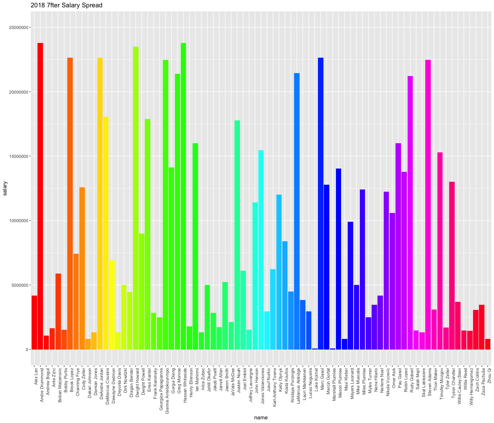
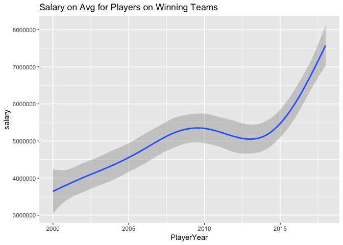
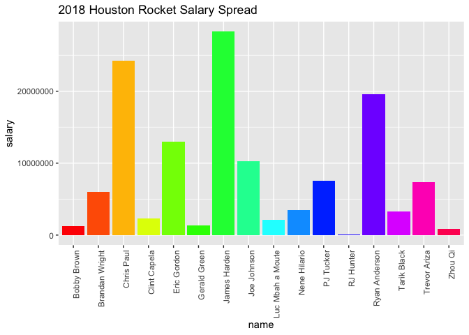
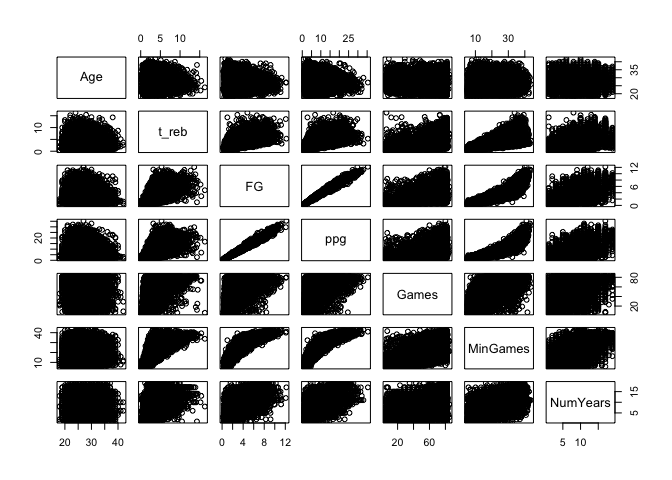

#Constructing a template for NBA salary negotiations


### **Introduction:**

The purpose of this report is to establish a reference point for NBA players, agents and teams in salary negotiation talks.  It looks at the 3-point trend in the NBA, foreign player salaries, modern 7ft player salaries, reference for award salaries, the mid-level exception and runs a multiple linear regression in attempt to predict salary.   Data was collected from the 2000 to 2018 NBA season.  

### **Data Collection:**

The data was collected from a variety of sources.  The data after the wrangling and cleaning contained 7978 observations with 57 variables.  Salary was collected from Hoopshype a NBA third party news site that reports latest player transaction and NBA salary negotiations.  The 2000 salary data was collected from Patricia Bender’s website.  Land of Basketball provided NBA award data.   Player statistics was collected from basketball reference, and college and age data were collected from NBA STATs.   The 4 NBA collective bargaining agreements and NBA contract structure were used as a reference to better understand salary negotiations between the Players Association and all 30 NBA owners.  All the data was merged using a full_join() by player_name and named 2000_2018_nba.csv.     

Below are links to the data sources:

  [NBA STATS](https://stats.nba.com)（The official NBA statistics site for player and team statistics）

  [Basketball Reference](https://www.basketball-reference.com)（A sports reference website that has collected historical data on all sports.） 

  [Patricia Bender](https://www.eskimo.com/~pbender/) (An individual who analyzed the state of the last 17 years of the CBA and provided salary information to Basketball Reference) 
	
  [CBA](http://www.cbafaq.com/salarycap.htm ) (Information on the changes and agreements of the collective bargaining agreements.)

  [NBA Contract](https://atlhawksfanatic.github.io/NBA-CBA/uniform-player-contract.html#bonuses ) (Analyzing an NBA contract explaining the different types of contracts as well as NBA player pensions.)  
	
  [Hoops Hype](https://hoopshype.com ) (NBA news site, and salary reference) 
	
  [Land of Basketball](https://www.landofbasketball.com ) (Website containing historical information on awards and nominations of the NBA) 
    
### **Data Wrangling and Cleaning:**

A few of the main challenges with this data was it was collected from different sources.  Three main data sources were used, Hoopshype for salary, basketball reference for player statistics and NBA STATs for age and college information.  The salary data was collected using rvest to webscrape the data tables from their website.  Other data was collected through CSV files.  The main challenge with cleaning the data was that each source had different spellings for player names.  Some sources had the suffixes for the name others did not, some used the passport name of the player while other sources used the American basketball name.  Since each year had different players that could have a Jr or an apostrophe in their name each season was cleaned individual before using a rbind to combine them all.  

Other challenges with data cleaning was to remove duplicate players, injured players, players that were legally on contract with the team but were no longer playing and players that were traded that showed up more than once in a season.  

After doing a full_join() on salary, player statistic, age and college information there were still some NA’s for salary and player statistics since the number of players for each season was inconsistent for the three data sources.  The reason for this is because some of the sources decided to include players that were on 2-way or 10-day contracts.  2-way contracts are for teams that are in the NBA G league. (The NBA development league.)  10- day contracts, are also contracts for players that play in the G league as well as for a way for the 30 teams to sign players left on the market to test contracts before fully committing to a player for the entire season.  
Missing salary and statistic data were added back in from Patricia Benders website and basketball reference.  Originally the 2019 season was also included, but I decided to remove it since the season was still ongoing at this time.  I then also ran a filter to remove players that did not play more than 5 games, 5 minutes per game and did not score 1 point per game.  

In the time period from 2000 to 2018, the Vancouver Grizzlies became the Memphis Grizzlies, the Seattle Supersonics became the Oklahoma City Thunder, the New Jersey Nets became the Brooklyn Nets, the Charlotte Hornets became the New Orleans Pelicans, Charlotte under the leadership of Michael Jordan got their team back and got their team back but were named the Bobcats before switching the name back to the Hornets. 

I chose to change the old team names to the newer one.  I used grepl and gsub to perform this task. For example, from 2000 to 2007 the Seattle Supersonics team would be changed to the Oklahoma City Thunder. While, this is inaccurate it won’t affect the players data and stats, but it will keep track of team win history through 2000 to 2018.

###**Data Exploration:** 

Doing an initial exploration on salary we find that the CBA structure of the 25-35 Max player contract causes the salary distribution to be skewed right.  Which awards star or all-star caliber players on teams to get a majority of a team’s salary.  

<!-- -->

The salary structure in the NBA is a little rigid as each CBA usually lists a salary scale according to basketball related income for veterans, rookies, players signed to the mid-level exception, biannual exception, 10 day, 2- way contracts and minimum contracts.  

For max salary contract players, the new 2017 CBA allows players to access the ability to get 35 percent of the that seasons salary cap.  The circumstances are making an All-NBA team twice within 3 years before signing the contract or win MVP or defensive player of the year to be able to access the full max contract.    The Derrick Rose rule which was set in the 2011 CBA now allows rookies to access the full max earlier now by winning MVP or making an All-NBA team twice.  By not winning these awards or not playing 7-9 years in the league a player can only access 25-30 percent of the current salary cap.  

Another trend is the huge salary bump in 2015 for most NBA players.  

<!-- -->

<!-- -->

Looking at Spanish basketball player Pau Gasol who has made a few all-star teams we can see that at 35 he should be reaching the end of his NBA life cycle.  Going into the 2016 season he received a huge salary boost.  We can also see a similar trend for Jamal Crawford who has won multiple sixth man of the year awards also received a huge salary boost during the same year.  

The sudden payment to NBA players with the huge salary cap boost can be mainly attributed to the new TV contract that the NBA signed.  

  [BRI](https://www.investopedia.com/articles/investing/070715/nbas-business-model.asp)
  
  [TV Deal](http://www.nba.com/article/2017/04/05/nba-tv-ratings-promising-first-year-new-deal)

<!-- -->

<!-- -->

Player salary is attached to the salary cap each season which is dictated by basketball related income.  Due to the increase in popularity and spread of social media and ways the league can earn revenue this could explain the huge spike in player salaries beginning after 2015.  Many teams because of this anticipation of the 2017 CBA signed their players to contract structures dictated by the 2011 CBA.  Thus, they gave more money to players than they usually would during the 2016 and 2017 season.  A total of 2 billion dollars was spent during the 2016 free agency market.  

**The salary of a 3-point shooter**

The trend in the NBA shows that more players over the years have been attempting more 3’s and taking less 2’s.  

<!-- -->

There is no strong correlation at the moment between salary and threes.  However, the 3-point revolution according to many news sites started after the 2015 Championship where a jump shooting team finally won a championship.  

<!-- -->

There is a weak correlation between salary and threes made(0.28), three-point attempts(0.28) and three-point percentage(0.04).  However, if we look at winning compared to three pointers and separate players who made three 3pointers a game and those who did not we can see there is a big discrepancy in wins.  


```
## # A tibble: 11 x 5
##    PlayerYear meanW `median(TeamWins,… `max(TeamWins, n… `min(TeamWins, n…
##         <int> <dbl>              <dbl>             <int>             <int>
##  1       2002  41                 41                  41                41
##  2       2004  55                 55                  55                55
##  3       2006  35                 35                  35                35
##  4       2007  31                 31                  31                31
##  5       2008  32                 32                  32                32
##  6       2013  47                 47                  47                47
##  7       2014  42.5               42.5                51                34
##  8       2015  67                 67                  67                67
##  9       2016  63.3               73                  73                44
## 10       2017  54.9               55                  67                36
## 11       2018  57.4               58                  65                48
```

<!-- -->

```
## # A tibble: 19 x 5
##    PlayerYear meanW `median(TeamWins,… `max(TeamWins, n… `min(TeamWins, n…
##         <int> <dbl>              <dbl>             <int>             <int>
##  1       2000  40.1                 42                67                15
##  2       2001  40.6                 45                58                15
##  3       2002  40.9                 42                61                21
##  4       2003  40.8                 43                60                17
##  5       2004  41.0                 41                61                21
##  6       2005  40.4                 43                62                13
##  7       2006  41.1                 41                64                21
##  8       2007  40.6                 40                67                22
##  9       2008  40.6                 41                66                15
## 10       2009  40.8                 41                66                17
## 11       2010  40.1                 42                61                12
## 12       2011  40.9                 42                62                17
## 13       2012  32.8                 35                50                 7
## 14       2013  40.8                 41                66                20
## 15       2014  40.9                 43                62                15
## 16       2015  40.6                 40                67                16
## 17       2016  40.6                 42                73                10
## 18       2017  40.6                 41                67                20
## 19       2018  40.2                 44                65                21
```

<!-- -->

After the 2015 season it showed players who made more than 3 three’s per game on average their teams won 55 games.  While, teams who had players who made less than 3 three’s a game only won on average 40-42 games.   Winning 40-42 games through the 2000-2018 season would normally only get you 8th seed in the east while you would be 9th or 10th seed in the west. Therefore, as a general manager you would want to keep a look out for these players who have the ability to make more than 3 three’s a game.  Out of 7978 observations only 27 observations were able to do so.  While only one observation Jason Richardson was the only player who did not make an All-NBA team.  From a team’s perspective or an agent’s perspective then these players who have the ability to make more than 3 threes a game are valuable.  


```
##                name PlayerYear   salary  ppg three
## 1         Ray Allen       2002 11250000 21.8   3.3
## 2   Peja Stojakovic       2004  6250000 24.2   3.0
## 3         Ray Allen       2006 13223140 25.1   3.4
## 4         Ray Allen       2007 14611570 26.4   3.0
## 5  Jason Richardson       2008 11111110 21.8   3.0
## 6     Stephen Curry       2013  3958742 22.9   3.5
## 7     Ryan Anderson       2014  8308500 19.8   3.0
## 8     Stephen Curry       2014  9887642 24.0   3.3
## 9     Klay Thompson       2015  3075880 21.7   3.1
## 10    Stephen Curry       2015 10629213 23.8   3.6
```

```
##          Salary
## mean   14437429
## max    34682550
## min     3075880
## median 12112359
## stdev   8172376
```

The average salary for the past 19 seasons is 14437429 which should be starting talks for a team if they are able to find a player who has this capability.  However, if the player dictates terms and knows his value, he could possibly dictate probably twice this amount until there are more observations in the future and there are more players in the market who have the ability to make more than 3 threes a game.  

<!-- -->

Looking at the plot above in today’s NBA market a player who has the ability to make more than three 3’s a game could possibly command a salary above 20 million dollars a year.  This type of contract is near close to the max and could vary depending on the number of years the player has played in the NBA. 

**Modern Day 7fters NBA Salary** 

The average height of the NBA player did not decrease that much over the past 19 seasons.  


```
##    PlayerYear   height  salary
## 1        2000 200.9356 2880067
## 2        2001 200.9545 3398885
## 3        2002 201.5609 3487920
## 4        2003 201.6292 3783693
## 5        2004 201.3472 3817195
## 6        2005 201.4734 3911320
## 7        2006 201.0049 4091303
## 8        2007 200.6675 4140794
## 9        2008 200.8610 4574357
## 10       2009 201.2897 4715669
## 11       2010 200.9824 4829387
## 12       2011 201.3957 4560710
## 13       2012 200.9750 4348460
## 14       2013 200.8822 4447435
## 15       2014 200.9120 4402763
## 16       2015 200.8978 4430783
## 17       2016 201.1982 5097982
## 18       2017 201.1186 6218880
## 19       2018 200.5735 6450838
```

We can see average salary increased by 1.2 million dollars from 2016 to 2017.  Again, this is largely due to the TV deals that was recently signed. 

<!-- -->

We can see big men over the height of 7ft(213cm) is still quite rare in the NBA.   They only make about 10 percent of the players during each NBA season.  However, height can be misleading as taller players usually list themselves shorter at 6ft 9, 10 or 11 on their player card.  I decided to change the height requirement to 210 cm.  A prime example of player listed height not matching actual height is Kevin Durant who is over 7ft tall but lists himself at 6ft 9 inches.  Looking at the trend we can see more big men are taking more 3’s and slimming down. 

<!-- --><!-- -->

The weight metric is relatively important especially for 7fters and the rest of the NBA players as some teams do have stipulations for salary in contracts for players to stay in shape to play a much faster pace in today’s game.  

<!-- -->

For a baseline for players over 7ft, we can see that the average salary didn’t increase that much through the 19 seasons.  The mean salary for 19 seasons is 5322469, min was 55000 and max was 27696430.  


```
##          Salary
## mean   14437429
## max    28000000
## min       55000
## median  3589566
## stdev   5545894
```

<!-- -->

Going off the 2018 contracts for 7fters, we see that the top 5 paid 7fters are Andre Drumond, Hassan Whiteside, Dwight Howard, Brook Lopez and Deandre Jordon command a salary over 20 million dollars a year.  


```
##                     name   salary  ppg three t_reb block
## 1         Andre Drummond 23775506 15.0   0.0  16.0   1.6
## 2       Hassan Whiteside 23775506 14.0   0.0  11.4   1.7
## 3          Dwight Howard 23500000 16.6   0.0  12.5   1.6
## 4            Brook Lopez 22642350 13.0   1.5   4.0   1.3
## 5         DeAndre Jordan 22642350 12.0   0.0  15.2   0.9
## 6             Marc Gasol 22642350 17.2   1.5   8.1   1.4
## 7           Steven Adams 22471911 13.9   0.0   9.0   1.0
## 8  Giannis Antetokounmpo 22471911 26.9   0.6  10.0   1.4
## 9      LaMarcus Aldridge 21461010 23.1   0.4   8.5   1.2
## 10           Greg Monroe 21384175 10.3   0.0   6.9   0.5
```

Looking at the top 10 paid 7fters, the value comes from grabbing rebounds and protecting the rim.  Looking at the list however, only 2 of these are traditional back to the basket big men.  The rest are players who play the pick and roll or pick and pop.  This is where they roll to the basket or shoot the 3-pointer or long mid-range 2-pointer.   Looking at the salary amount these players are signed at 20-25 percent of the current salary cap which was 99 million dollars for the 2018 season.  Depending on the market  for numbers of buyers(teams with cap) and sellers(players seeking teams) these types of players could receive up to the max or the salary of a 2nd or 3rd option on a team.  

**Foreign Player Salary in the NBA**

With the increase of globalization of the NBA it is important to look at international prospects and players as there might be huge player market outside the United States.  

<!-- -->

Overall salaries paid to international players increased year by year. If we split it by country to see where most of these players are coming from we see that Spain and France represent most of the international population


```
## # A tibble: 10 x 3
##    country   count_country    salary
##    <fct>             <int>     <dbl>
##  1 France              102 548647323
##  2 Spain                68 515601566
##  3 Brazil               62 329170240
##  4 Germany              29 278303863
##  5 Argentina            55 262352074
##  6 Turkey               45 261965589
##  7 Slovenia             52 199606417
##  8 Lithuania            27 199502355
##  9 Italy                32 197172659
## 10 Russia               32 180585067
```

<!-- -->

Spain and France in the past 19 seasons have dominated the European league last 2 decades.  For France notable players are Tony parker and Boris Diaw, for Spain they have the Gasol brothers.  Spain also arguably has one of the best leagues outside the NBA.  La Liga ACB with the most notable team Real Madrid Baloncesto.  Because of the age minimum in the NBA it has forced basketball players to look at other options to play professionally before entering the NBA.  One of the most recent notable players is Luka Doncic who played one season with Real Madrid before being drafted in the NBA.  What makes the Spanish league attractive to players is the actual team doesn’t have a salary cap so the team can spend as much as their team president allows.  

The main reason why many players from international leagues can’t make an easier transition to the NBA is they are usually legally obligated to finish out their international contracts with their club.   The NBA only allows up to 600,000 dollars for teams to be spend on player contract buyouts.  The rest of contract has to be bought out by the player himself.  The problem with this is these international players are they are locked into lower rookie contracts which is not enough to cover the cost of their contract with their international club.  Teams are allowed more flexibility in contract talks if they allow these players to drop into the 2nd round.  However, the team risks the player being drafted by another team.  Teams also could just maintain the rights of the player however the wait time for these players to come from oversees can be upwards to 4 years which sacrifices valuable player development time.  


```
##          Salary
## mean    5002830
## max    25000000
## min       61775
## median  3149524
## stdev   4771831
```

Now for a reference point for foreign players and salaries. The minimum salary for foreign players the past 19 seasons was 61775, this was probably a 10-day contract or a 2-way contract for a foreign player playing in the developmental league.  

**Analysis of the Best and Worst team salaries in the NBA**

<!-- --><!-- -->

For the past 19 seasons we can see that winning teams spend on average over the salary cap.  While losing teams will tend to spend close to the salary cap.  Teams who are unable to sign free agents they want, will still have to spend close to the cap according to stipulations in the CBA.  If they do not spend close the salary cap for that year, they will have to spread the difference on a pro rata basis between all current players on the team’s roster.  This has caused teams who have huge cap space to sign players to ridiculous 1-year contracts just to fill this salary cap space.  Another affect this has caused is teams signing average players to contracts close to the max in fear of getting nothing in the free agent market or in the fear of losing their only somewhat productive player to another team.  The Celtics avoided this trap by trading away Isaiah Thomas.  
  [Isaiah](https://nesn.com/2018/07/why-nba-insider-believes-isaiah-thomas-never-had-shot-at-max-contract/)

Armed with this information we as a team or an agent can better advise players for what type of team, they would want to sign with be it a team that is tanking and filling in salary or a contending championship team. Below is the top paid player on the best and worst team through the 2000-2018 season.   

<!-- --><!-- -->

Now if we split the mark for teams with winning percentages, teams that won more than 42 games and teams with losing percentages.  We can see in the 2018 season that teams have spent close to 8 million on average per player while losing teams have spent just above 7 million dollars per player.  

<!-- --><!-- -->

Below is a table for the benchmarks differences between winning teams and losing teams for the past 19 seasons. 


```
##        Salary Win Salary Lose
## mean      5122276     4041735
## max      34682550    30453000
## min          2853        6000
## median    3033000     2446600
## stdev     5387179     4335375
```

**Average salary vs Award Winners Salaries and a look at the Mid-Level exception player**


```
##         ppg  salary      age    t_reb   assist
## 1  8.356086 2880067 27.74702 3.805489 1.926969
## 2  8.421970 3398885 27.72727 3.886616 1.927273
## 3  8.605330 3487920 27.18782 3.899239 1.955838
## 4  8.443223 3783693 27.12788 3.843223 1.909719
## 5  8.566062 3817195 27.13731 3.920466 1.946891
## 6  8.751691 3911320 26.94928 3.853382 1.914010
## 7  8.699022 4091303 26.54279 3.739120 1.831051
## 8  8.775534 4140794 26.44893 3.686698 1.876960
## 9  8.801737 4574357 26.84367 3.806700 1.949132
## 10 9.029723 4715669 26.57683 3.847355 1.875819
## 11 9.028141 4829387 26.63065 3.848995 1.907035
## 12 8.773621 4560710 26.63309 3.779376 1.876499
## 13 8.311364 4348460 26.58182 3.701364 1.835682
## 14 8.513395 4447435 26.74134 3.721247 1.934180
## 15 8.694808 4402763 26.56208 3.747178 1.915124
## 16 8.568444 4430783 26.68667 3.741111 1.905333
## 17 8.797523 5097982 26.71171 3.803153 1.929505
## 18 8.970694 6218880 26.44743 3.762640 1.930425
## 19 8.973319 6450838 26.18697 3.704202 1.993277
```

Average Joe was calculated by taking the mean of all players for every season.  If we look at the table, the average joe salary through 2000- 2016 changed from about 100,000 to 600,000 dollars each season. However, going into the new 2017 CBA the average salary increased by about 1.2 million dollars.  Which make sense since the 2017 CBA salary scale increased for veterans, rookies that are in the lottery as well as max players.


The average salary increased over the years as well as the average player scoring more points per game.


*MVP and DPOY vs Avg Joe*

<!-- -->

MVP salary of course is above the average joe salary. Winning the MVP award allows players to get the maximum contract. Other ways to obtain the max contract including making the All-NBA team consistently. This is in the CBA called the designated player exception.

The designated player exception: Applies to players that have 7 to 9 years of NBA experience. It allows players to get paid the max which is 35 percent of the current salary cap. Players before needed to be 10 years in the league before making 35 percent. (7 to 9 made 30, 0 to 6 made 25 percent of the salary cap.)

The requirements also are that the player must make two All-NBA teams or win defensive player of the year or MVP 3 years prior to signing the deal. We can see defensive player of the year salary is well above average Joe as well.  

<!-- -->

  [CBA](https://www.foxsports.com/nba/story/nba-6-important-aspects-of-the-new-collective-bargaining-agreement-122016)

The Derrick Rose rule allows rookies to sign for 30 percent of the team salary cap if they were voted to the all star game twice and got on two All-NBA teams.  Winning the MVP would also qualify the player to get 30 percent of the salary cap.  


```
##        Salary MVP Salary DPOY
## mean     15194637    13900644
## max      28299399    24751934
## min       6993708     5200000
## median   14500000    15004800
## stdev     4995717     4957578
```

We can see that MVPs make more money than players that win defensive player of the year. 

*All-NBA and All-Defensive teams*

<!-- --><!-- -->

All-NBA players seem to receive a higher salary than All-Defense players.  In NBA contracting through the agreements of the CBA there doesn’t seem to be a salary increase for players who make it to all defensive teams.  If we look at the salary scale of an All-NBA player, we see that the mean salary is 14752955, max salary is 34682550, min salary is 2157595 and median salary is 14693906.  Looking at the all-defensive team, the mean salary is 12274335, max salary is 28000000, min salary is 715850 and median salary is 12289544.  All-NBA players are more recognized through the media and usually get voted in the yearly all-star games more often than players who are on the all-defensive team.  It is important to note that most of these award voting is done not by the coaches and league players who actually play the game but the media people who cover and report interesting stories and headlines on the NBA.  


```
##        Salary All_NBA Salary All_Def
## mean         14752955       12274335
## max          34682550       28000000
## min           2157595         715850
## median       14693906       12289544
## stdev         5997040        6523668
```

*The mid-level exception player*

The Mid-level exception is probably one of the most interesting salary exceptions allowed in the NBA.  It allows teams that are at their salary cap to still sign a player at that year’s average salary.  There are 3 types of mid-level exceptions.

The non-taxpayer mid-level exception, the taxpayer mid-level exception and the room mid-level exception.  The non-taxpayer mid-level exception is for teams that are under that luxury tax apron which is 4 million dollars above the tax line.  The amount and number of years that the player can be signed for is much less than the non-taxpayer mid-level exception.  The room mid-level exception is for teams under the cap and the exception amount is the lowest as well as the number of years a player can be signed to this exception. 

Before the 2011 CBA the mid-level exception was tied to salary cap.  It was the average salary for all teams over the salary cap during that season.  Past 2011 it has been a fixed amount each year.  The mid-level exception can be used on multiple players as well.  


<!-- -->

Data online for players signed by the mid-level exception wasn’t available for the last 19 seasons. What I wanted to analyze with the mid-level exception was what players each year teams could potentially sign with the mid- level exception when they were near the salary cap. The mid-level exception line above was created by taking the mid-level exception each year and selecting players whose salaries were 25 percent lower or above this mid-level exception salary number. While, of course there could be players who will be willing to take a massive pay cut to play for certain teams, this isn’t something that normally would happen on average. (David West rejected 12.5 million dollars a year to accept the veteran’s minimum with the Spurs.)

  [David West](https://www.businessinsider.com/nba-david-west-spurs-pay-cut-2015-9)

It is interesting to see that players before the 2011 CBA before a fixed number was set for the mid-level exception, were able to sign better quality players on average.  However, after the 2011 CBA we can see the quality drops significantly if we compare the mid- level exception player to the average players ppg we can see there is a drop off perhaps due to the salary drop.  


```
##        Salary Mid Level Salary Avg Joe
## mean          4011166.4      4399391.6
## max           6352531.0      6450837.9
## min           2250000.0      2880066.5
## median        3937500.0      4402762.6
## stdev          964928.2       869631.1
```

Looking at min, max, median, mean and standard deviation, we can see that there isn't much of a difference if you compare using the 2000-2018 season data.  

### **Multiple Linear Regression model and Decision Tree analysis** 

To attempt to build a model to predict salary I used a multiple linear regression model and also tried the model through decision tree analysis.  For the training set I used the 2000-2014 season and for the test set the 2015-2018 season was used.  


```
## 
## Call:
## lm(formula = salary ~ Age + t_reb + FG + ppg + Games + MinGames + 
##     NumYears, data = nbaTrain)
## 
## Residuals:
##       Min        1Q    Median        3Q       Max 
## -11851583  -1817891   -230732   1396678  18798576 
## 
## Coefficients:
##             Estimate Std. Error t value       Pr(>|t|)    
## (Intercept) -8880912     262120 -33.881        < 2e-16 ***
## Age           335401       8952  37.468        < 2e-16 ***
## t_reb         389459      22007  17.697        < 2e-16 ***
## FG            335464     133017   2.522         0.0117 *  
## ppg           298178      48140   6.194 0.000000000624 ***
## Games         -23806       2249 -10.583        < 2e-16 ***
## MinGames      -59950      10755  -5.574 0.000000025956 ***
## NumYears      186689      10914  17.105        < 2e-16 ***
## ---
## Signif. codes:  0 '***' 0.001 '**' 0.01 '*' 0.05 '.' 0.1 ' ' 1
## 
## Residual standard error: 2984000 on 6153 degrees of freedom
## Multiple R-squared:  0.5318,	Adjusted R-squared:  0.5313 
## F-statistic: 998.4 on 7 and 6153 DF,  p-value: < 0.00000000000000022
```

The first model used age, total rebounds, points per game, games played minutes per game, number of years and two-point shots made. I then removed two-pointers made since it wasn’t significant to the model.  The adjusted R squared from that model was approximately 0.53 which means 0.47 wasn’t predicted by the model. 


```
##            Age t_reb    FG   ppg Games MinGames NumYears
## Age       1.00 -0.01 -0.05 -0.05 -0.02     0.03     0.08
## t_reb    -0.01  1.00  0.62  0.58  0.41     0.66     0.41
## FG       -0.05  0.62  1.00  0.99  0.50     0.90     0.51
## ppg      -0.05  0.58  0.99  1.00  0.49     0.90     0.51
## Games    -0.02  0.41  0.50  0.49  1.00     0.60     0.38
## MinGames  0.03  0.66  0.90  0.90  0.60     1.00     0.54
## NumYears  0.08  0.41  0.51  0.51  0.38     0.54     1.00
```

<!-- -->

To make sure the multiple linear regression was valid I tested it for multicollinearity and if the error terms were homoscedastic.  To test for multicollinearity, I first looked at the correlations.  If the correlations between two explanatory variables was above 0.8 there would be a high chance of multicollinearity in the model. Field goal and points per game had a correlation of 0.99, while minutes per game, field goals and points ger game had a 0.9 correlation. 


```
##       Age     t_reb        FG       ppg     Games  MinGames  NumYears 
##  1.052409  2.018427 55.860798 54.848244  1.631676  7.415581  1.459289
```

```
## 
## Call:
## lm(formula = salary ~ Age + t_reb + Games + ppg + NumYears, data = nbaTrain)
## 
## Residuals:
##       Min        1Q    Median        3Q       Max 
## -11211701  -1875320   -200382   1437061  18654055 
## 
## Coefficients:
##             Estimate Std. Error t value Pr(>|t|)    
## (Intercept) -8855318     262677  -33.71   <2e-16 ***
## Age           325688       8820   36.92   <2e-16 ***
## t_reb         371317      19534   19.01   <2e-16 ***
## Games         -28490       2081  -13.69   <2e-16 ***
## ppg           346048       8999   38.46   <2e-16 ***
## NumYears      179648      10881   16.51   <2e-16 ***
## ---
## Signif. codes:  0 '***' 0.001 '**' 0.01 '*' 0.05 '.' 0.1 ' ' 1
## 
## Residual standard error: 2992000 on 6155 degrees of freedom
## Multiple R-squared:  0.529,	Adjusted R-squared:  0.5287 
## F-statistic:  1383 on 5 and 6155 DF,  p-value: < 0.00000000000000022
```

```
##      Age    t_reb    Games      ppg NumYears 
## 1.016150 1.581476 1.388780 1.905876 1.442247
```

```
## [1] 2990696
```

A variance inflation factor test was run.  Variance inflation is calculated as 1/tolerance where tolerance is the percent of variance in the predictor that cannot be accounted for by other predictors.   We wanted to have a VIF score to be close to 1 but under 5.  However, we did not want a VIF over 10 which means this variable was not needed and could be removed from the model.

Field goals had a VIF score of 55.8. Field goals was removed, and I remade the model again with field goals removed and ran the VIF test again. I then removed minutes per game which had a VIF score of 7.4.  We then arrived at a model where all the VIF scores were below 5 and close to 1.  

Then ran a histogram to see if the residuals are normally distributed. However, the model failed the assumption of homoskedasticity. Looking at the residuals vs fitted plot and running a Breusch-Pagan test it confirmed it.

To resolve heteroscedasticity in the model I transformed the model using box-cox transformation to try to transform the salary variable to make it approximately normal.  I ran two box-cox transformations with the second one yielding a better result.   

*Box Cox Transformation of Salary*

<!-- -->

I chose a lamba of 0.2 to transform salary when looking at this chart.


```
## 
## Call:
## lm(formula = salary^(0.2) ~ Age + t_reb + Games + ppg + NumYears, 
##     data = nbaTrain)
## 
## Residuals:
##      Min       1Q   Median       3Q      Max 
## -12.2817  -1.8732   0.0329   1.9742  11.2124 
## 
## Coefficients:
##             Estimate Std. Error t value Pr(>|t|)    
## (Intercept) 4.914164   0.250658  19.605   <2e-16 ***
## Age         0.331697   0.008417  39.409   <2e-16 ***
## t_reb       0.344405   0.018640  18.477   <2e-16 ***
## Games       0.000609   0.001986   0.307    0.759    
## ppg         0.279825   0.008587  32.588   <2e-16 ***
## NumYears    0.209825   0.010383  20.209   <2e-16 ***
## ---
## Signif. codes:  0 '***' 0.001 '**' 0.01 '*' 0.05 '.' 0.1 ' ' 1
## 
## Residual standard error: 2.855 on 6155 degrees of freedom
## Multiple R-squared:   0.55,	Adjusted R-squared:  0.5496 
## F-statistic:  1504 on 5 and 6155 DF,  p-value: < 0.00000000000000022
```

```
## [1] 12933.74
```

For the second box-cox transformation model the adjusted R-squared was 0.5496 which was an improvement over the original model.  The RMSE also decreased from the original model. From 2990696 to 12933.74. The residuals became constant indicating that the model no longer suffers from heteroscedasticity. 

<!-- --><!-- --><!-- --><!-- -->

Transforming it again shows that we get rid of the heteroscedasticity. Then I double checked to see if the errors were normally distributed. 

<!-- -->

I then ran the model through the test data which contained data from the 2015-2018 NBA season.  The R squared got worst to 0.44 while the RMSE went up which means the model got worst at predicting salary.  


*Decision Tree*

<!-- -->


```
##        Decision Tree Box Cox Transformation
## rmse 1655599.7125872        2425442.3667801
## R2         0.3450517              0.4437364
## mean 5637083.2768299        5637083.2768299
```

Both of these models both indicate that the original model using the training data set from the years 2000-2014 did a worst job of predicting salary for the 2015-2018 season.  Both the R squared for the decision tree (0.345) and box cox transformation model (0.44) fell compared to the original models, using the training data, that had R squares of 0.53(non transformed) and 0.55(Box cox transformed).  Hence, there are other factors outside are explanatory variables that may be better predictors of salary.  Some of these predictors I believe is outside of the realm of our data.  

One of the biggest factors could be the calculation of basketball related income.  The BRI linked not only to the American networks but also international networks.  Another factor to look at is the social media model that is collecting revenue outside traditional media.  Other factors that could determine player and team negotiations is the players chemistry with the coach, general manager, his community and also his social media influence.  

### *Conclusion*
The goal of this report was to establish a baseline or a cost guide for teams, players or agents to use in the salary negotiation process.  We were able to develop baselines from exploring trends in the NBA looking at important metrics like 3 pointers made and if the client or player was 7ft tall what type of salary landscape they would expect. We also explored the cost guide/salary guide for an abroad player and what expectations of what the team or the player could expect. The data then found that award winners which is awarded by the media got more salary than the average player.  

The last thing we did was run a regression model. What we found in the regression model was that there were other variables outside the explanatory variables put in the model that might do a better job in predicting player salary.  These factors could be the new compensation structure in the 2017 CBA, individual team bonus structure for specific players, player pension with the NBA and their team, player branding outside the scope of the NBA revenue system, the increased power of the players association.  

To better improve our or future models we would most likely want to develop a few variables that account for new agreements of the collective bargaining agreement that happens every 6 – 10 years. Another improvement we could make is create a social power index for players based on their Instagram or twitter following. We would also want to take into account the agency the player is being represented by and perhaps give each sports agency a grading system based on historical signings for the last 20 years. Another feature if I had more time to do this with more resources is to structure the data of the NBA players contract to indicate how many years left the player has on his contract and whether the contract has a player option, team option or if the team has the Birds rights to the player.  


