###Library's Used


###Loading in the data


###Splitting up the Test and Training data.  Used 2000-2014 data to make the training set and will test it on the 2015-2018 seasons.


###First model going to put in age, total rebounds, points per game, games played, minutes per game, number of years and two point shots.  


```
## 
## Call:
## lm(formula = salary ~ Age + t_reb + ppg + FG + Games + MinGames + 
##     NumYears + two, data = nbaTrain)
## 
## Coefficients:
## (Intercept)          Age        t_reb          ppg           FG  
##    -8909499       336154       368920       329934       117075  
##       Games     MinGames     NumYears          two  
##      -23683       -54484       187513       142387
```

```
## 
## Call:
## lm(formula = salary ~ Age + t_reb + ppg + FG + Games + MinGames + 
##     NumYears + two, data = nbaTrain)
## 
## Residuals:
##       Min        1Q    Median        3Q       Max 
## -11933827  -1807654   -230062   1408615  18741297 
## 
## Coefficients:
##             Estimate Std. Error t value Pr(>|t|)    
## (Intercept) -8909499     262775 -33.905  < 2e-16 ***
## Age           336154       8964  37.498  < 2e-16 ***
## t_reb         368920      25867  14.262  < 2e-16 ***
## ppg           329934      52525   6.281 3.58e-10 ***
## FG            117075     196450   0.596    0.551    
## Games         -23683       2250 -10.523  < 2e-16 ***
## MinGames      -54484      11347  -4.802 1.61e-06 ***
## NumYears      187513      10927  17.161  < 2e-16 ***
## two           142387      94264   1.511    0.131    
## ---
## Signif. codes:  0 '***' 0.001 '**' 0.01 '*' 0.05 '.' 0.1 ' ' 1
## 
## Residual standard error: 2984000 on 6152 degrees of freedom
## Multiple R-squared:  0.532,	Adjusted R-squared:  0.5314 
## F-statistic: 874.1 on 8 and 6152 DF,  p-value: < 2.2e-16
```

Two pointers seemed insignficant so will remove that variable.  


```
## 
## Call:
## lm(formula = salary ~ Age + t_reb + FG + ppg + Games + MinGames + 
##     NumYears, data = nbaTrain)
## 
## Residuals:
##       Min        1Q    Median        3Q       Max 
## -11851583  -1817891   -230732   1396678  18798576 
## 
## Coefficients:
##             Estimate Std. Error t value Pr(>|t|)    
## (Intercept) -8880912     262120 -33.881  < 2e-16 ***
## Age           335401       8952  37.468  < 2e-16 ***
## t_reb         389459      22007  17.697  < 2e-16 ***
## FG            335464     133017   2.522   0.0117 *  
## ppg           298178      48140   6.194 6.24e-10 ***
## Games         -23806       2249 -10.583  < 2e-16 ***
## MinGames      -59950      10755  -5.574 2.60e-08 ***
## NumYears      186689      10914  17.105  < 2e-16 ***
## ---
## Signif. codes:  0 '***' 0.001 '**' 0.01 '*' 0.05 '.' 0.1 ' ' 1
## 
## Residual standard error: 2984000 on 6153 degrees of freedom
## Multiple R-squared:  0.5318,	Adjusted R-squared:  0.5313 
## F-statistic: 998.4 on 7 and 6153 DF,  p-value: < 2.2e-16
```

```
## [1] 5.478312e+16
```

```
## [1] 2981932
```

```
## [1] 4195077
```

All the variables are significant.  The adjusted R squared remained at 0.5349.  The Root mean squared error is way too high 2947038 with a mean salary of 4195077.  

Lets test for one of the assumptions of multicollinearity 


```
##            Age t_reb    FG   ppg Games MinGames NumYears
## Age       1.00 -0.01 -0.05 -0.05 -0.02     0.03     0.08
## t_reb    -0.01  1.00  0.62  0.58  0.41     0.66     0.41
## FG       -0.05  0.62  1.00  0.99  0.50     0.90     0.51
## ppg      -0.05  0.58  0.99  1.00  0.49     0.90     0.51
## Games    -0.02  0.41  0.50  0.49  1.00     0.60     0.38
## MinGames  0.03  0.66  0.90  0.90  0.60     1.00     0.54
## NumYears  0.08  0.41  0.51  0.51  0.38     0.54     1.00
```

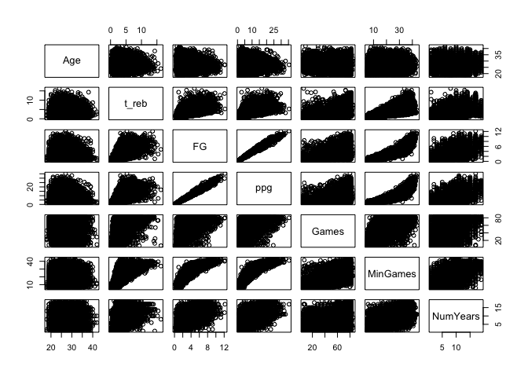<!-- -->

Going to use Variance inflation factor from cars factor to test for multicollinearity.  VIF is calculated as 1/tolerance where tolearnce is an indication of the percent variance in the predictor that cannot be accounted for by the other predictors. It assesses the relationship between each independednt variable and all the other variables.

Looking VIF scores should be close to 1 but under 5.  Over 10 means variable is not needed and can be removed from the model.


```
##       Age     t_reb        FG       ppg     Games  MinGames  NumYears 
##  1.052409  2.018427 55.860798 54.848244  1.631676  7.415581  1.459289
```

```
## 
## Call:
## lm(formula = salary ~ Age + t_reb + Games + ppg + NumYears + 
##     MinGames, data = nbaTrain)
## 
## Residuals:
##       Min        1Q    Median        3Q       Max 
## -11548971  -1806183   -227391   1401603  18865241 
## 
## Coefficients:
##             Estimate Std. Error t value Pr(>|t|)    
## (Intercept) -8857083     262064 -33.797  < 2e-16 ***
## Age           334600       8950  37.386  < 2e-16 ***
## t_reb         408681      20654  19.787  < 2e-16 ***
## Games         -23749       2250 -10.554  < 2e-16 ***
## ppg           413342      15244  27.115  < 2e-16 ***
## NumYears      185110      10901  16.981  < 2e-16 ***
## MinGames      -58711      10749  -5.462 4.89e-08 ***
## ---
## Signif. codes:  0 '***' 0.001 '**' 0.01 '*' 0.05 '.' 0.1 ' ' 1
## 
## Residual standard error: 2985000 on 6154 degrees of freedom
## Multiple R-squared:  0.5313,	Adjusted R-squared:  0.5309 
## F-statistic:  1163 on 6 and 6154 DF,  p-value: < 2.2e-16
```

Removed FG that had a VIF of 56


```
##      Age    t_reb    Games      ppg NumYears MinGames 
## 1.051083 1.776328 1.631516 5.495210 1.454486 7.400109
```

```
## 
## Call:
## lm(formula = salary ~ Age + t_reb + Games + ppg + NumYears, data = nbaTrain)
## 
## Residuals:
##       Min        1Q    Median        3Q       Max 
## -11211701  -1875320   -200382   1437061  18654055 
## 
## Coefficients:
##             Estimate Std. Error t value Pr(>|t|)    
## (Intercept) -8855318     262677  -33.71   <2e-16 ***
## Age           325688       8820   36.92   <2e-16 ***
## t_reb         371317      19534   19.01   <2e-16 ***
## Games         -28490       2081  -13.69   <2e-16 ***
## ppg           346048       8999   38.46   <2e-16 ***
## NumYears      179648      10881   16.51   <2e-16 ***
## ---
## Signif. codes:  0 '***' 0.001 '**' 0.01 '*' 0.05 '.' 0.1 ' ' 1
## 
## Residual standard error: 2992000 on 6155 degrees of freedom
## Multiple R-squared:  0.529,	Adjusted R-squared:  0.5287 
## F-statistic:  1383 on 5 and 6155 DF,  p-value: < 2.2e-16
```

```
##      Age    t_reb    Games      ppg NumYears 
## 1.016150 1.581476 1.388780 1.905876 1.442247
```

Removed minutes per game as it had a vif of 7.4 and finally all VIF is under 5 now.  

Now lets see if the residuals are normally distributed 

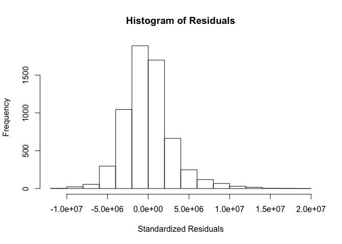<!-- -->

Residuals look relatively normally distributed 

###Testing for heterscedasticiy.  

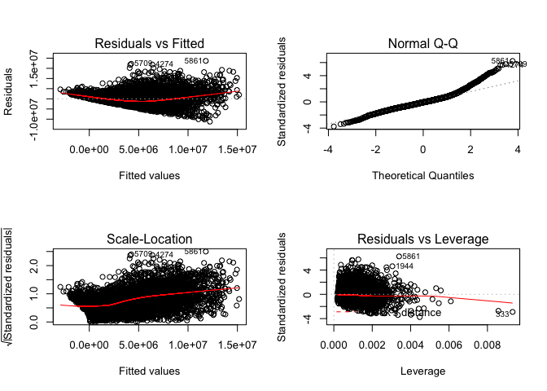<!-- -->

```
## 
## 	studentized Breusch-Pagan test
## 
## data:  nbaMacModel4
## BP = 893.18, df = 5, p-value < 2.2e-16
```

We can see the spread of the residuals is increasing going along the x values the spread is not constant.  
Doing a further test with the Breusch Pagan Test, involves using a variance function and using a chi squared test to test Ho for not present Homoscedastic and Ha has heteroschedasticity, we find that we have hetereoscedasticity. 

###Resolving Heteroscedasticity

2 main consequences
  1. Ordinary Least Squares no longer produces best estimators
  2. Standard Errors computed using Least squares can be incorrect and misleading

###Regression with Robust Standard Errors 

Accepting that OLS no longer produces best linear unbiased estimators.  


```
## 
## Call:
## lm(formula = salary ~ Age + t_reb + Games + ppg + NumYears, data = nbaTrain)
## 
## Residuals:
##       Min        1Q    Median        3Q       Max 
## -11211701  -1875320   -200382   1437061  18654055 
## 
## Coefficients:
##             Estimate Std. Error t value Pr(>|t|)    
## (Intercept) -8855318     262677  -33.71   <2e-16 ***
## Age           325688       8820   36.92   <2e-16 ***
## t_reb         371317      19534   19.01   <2e-16 ***
## Games         -28490       2081  -13.69   <2e-16 ***
## ppg           346048       8999   38.46   <2e-16 ***
## NumYears      179648      10881   16.51   <2e-16 ***
## ---
## Signif. codes:  0 '***' 0.001 '**' 0.01 '*' 0.05 '.' 0.1 ' ' 1
## 
## Residual standard error: 2992000 on 6155 degrees of freedom
## Multiple R-squared:  0.529,	Adjusted R-squared:  0.5287 
## F-statistic:  1383 on 5 and 6155 DF,  p-value: < 2.2e-16
```

The standard errors for b1 is 262677 the intercept and for Age is 8820, t_reb 19534, games 2081, ppg 8999 and NumYears is 10881, to compare them with robust standard errors we use the sandwich package 


```
## 
## t test of coefficients:
## 
##               Estimate Std. Error t value  Pr(>|t|)    
## (Intercept) -8855317.7   271984.9 -32.558 < 2.2e-16 ***
## Age           325687.6    10162.3  32.049 < 2.2e-16 ***
## t_reb         371316.7    24091.3  15.413 < 2.2e-16 ***
## Games         -28490.1     2324.6 -12.256 < 2.2e-16 ***
## ppg           346047.8    11132.2  31.085 < 2.2e-16 ***
## NumYears      179648.0    11669.1  15.395 < 2.2e-16 ***
## ---
## Signif. codes:  0 '***' 0.001 '**' 0.01 '*' 0.05 '.' 0.1 ' ' 1
```

There is a drastic difference in standard errors.   From the intercept to Age 271984 to 10162.  The huge difference may be due to the small sample size.  Doest address second issue of heteroscedasticity which is least square estimateors are no longer the best.

###General Least Squares is a technique to estimate unknown parameters in linear regression when there is a certain degree of correlation between residuals in a regression model.  


```
## 
## Call:
## lm(formula = log(resi^2) ~ log(Age) + log(t_reb) + log(Games) + 
##     log(ppg) + log(NumYears), data = nbaTrain)
## 
## Residuals:
##      Min       1Q   Median       3Q      Max 
## -16.3174  -0.9296   0.4978   1.4687   5.7016 
## 
## Coefficients:
##               Estimate Std. Error t value Pr(>|t|)    
## (Intercept)   18.48753    0.62803  29.437  < 2e-16 ***
## log(Age)       2.96230    0.18040  16.421  < 2e-16 ***
## log(t_reb)     0.40920    0.05725   7.147 9.88e-13 ***
## log(Games)    -0.56764    0.06205  -9.148  < 2e-16 ***
## log(ppg)       0.61157    0.05748  10.639  < 2e-16 ***
## log(NumYears)  0.30439    0.05155   5.905 3.72e-09 ***
## ---
## Signif. codes:  0 '***' 0.001 '**' 0.01 '*' 0.05 '.' 0.1 ' ' 1
## 
## Residual standard error: 2.242 on 6155 degrees of freedom
## Multiple R-squared:  0.1154,	Adjusted R-squared:  0.1147 
## F-statistic: 160.6 on 5 and 6155 DF,  p-value: < 2.2e-16
```

```
## 
## Call:
## lm(formula = salary ~ Age + t_reb + TO + Games + ppg + NumYears, 
##     data = nbaTrain)
## 
## Residuals:
##       Min        1Q    Median        3Q       Max 
## -11171007  -1869339   -188487   1440884  17000427 
## 
## Coefficients:
##             Estimate Std. Error t value Pr(>|t|)    
## (Intercept) -9007126     264084 -34.107  < 2e-16 ***
## Age           326874       8808  37.111  < 2e-16 ***
## t_reb         367649      19513  18.841  < 2e-16 ***
## TO            451159      93509   4.825 1.44e-06 ***
## Games         -28622       2077 -13.778  < 2e-16 ***
## ppg           297065      13556  21.915  < 2e-16 ***
## NumYears      178856      10862  16.466  < 2e-16 ***
## ---
## Signif. codes:  0 '***' 0.001 '**' 0.01 '*' 0.05 '.' 0.1 ' ' 1
## 
## Residual standard error: 2987000 on 6154 degrees of freedom
## Multiple R-squared:  0.5308,	Adjusted R-squared:  0.5304 
## F-statistic:  1160 on 6 and 6154 DF,  p-value: < 2.2e-16
```

```
## 
## Call:
## lm(formula = salary ~ Age + t_reb + TO + Games + ppg + NumYears, 
##     data = nbaTrain, weights = 1/sqrt(varfunc))
## 
## Weighted Residuals:
##     Min      1Q  Median      3Q     Max 
## -6033.9 -1575.8  -329.6  1202.2 13390.5 
## 
## Coefficients:
##             Estimate Std. Error t value Pr(>|t|)    
## (Intercept) -7072882     216003 -32.744  < 2e-16 ***
## Age           275040       7696  35.736  < 2e-16 ***
## t_reb         328812      18804  17.487  < 2e-16 ***
## TO            365867      86387   4.235 2.32e-05 ***
## Games         -23633       1805 -13.091  < 2e-16 ***
## ppg           259068      12865  20.138  < 2e-16 ***
## NumYears      144229       9332  15.455  < 2e-16 ***
## ---
## Signif. codes:  0 '***' 0.001 '**' 0.01 '*' 0.05 '.' 0.1 ' ' 1
## 
## Residual standard error: 2270 on 6154 degrees of freedom
## Multiple R-squared:  0.5069,	Adjusted R-squared:  0.5064 
## F-statistic:  1054 on 6 and 6154 DF,  p-value: < 2.2e-16
```

Ccomparing ordinary least sqaures and general least squares, gls r squared of 0.5069 and ols r squared of 0.5308, which makes ols better because of lower variances which results in a higher r squared.

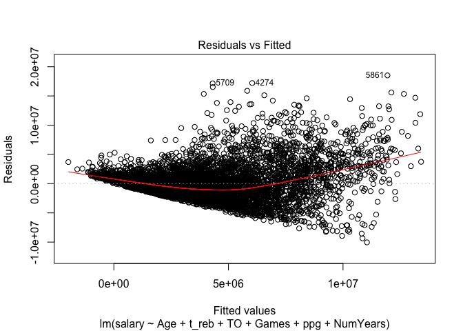<!-- -->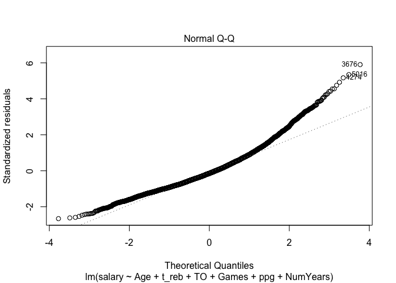<!-- -->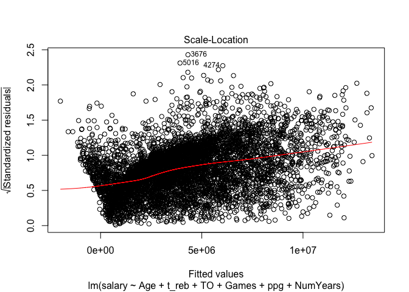<!-- -->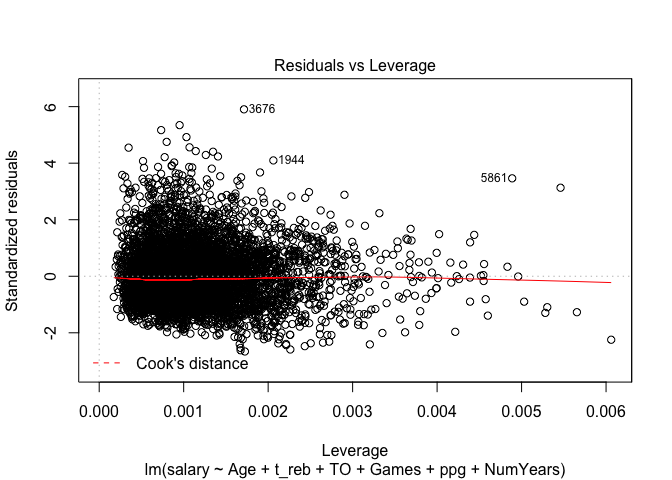<!-- -->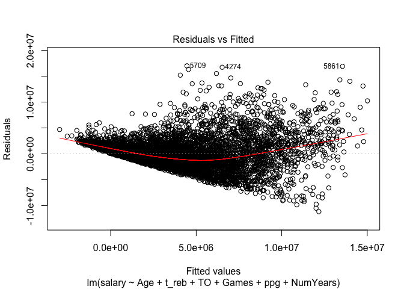<!-- -->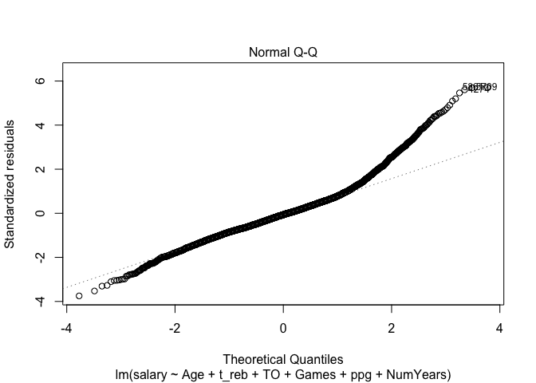<!-- -->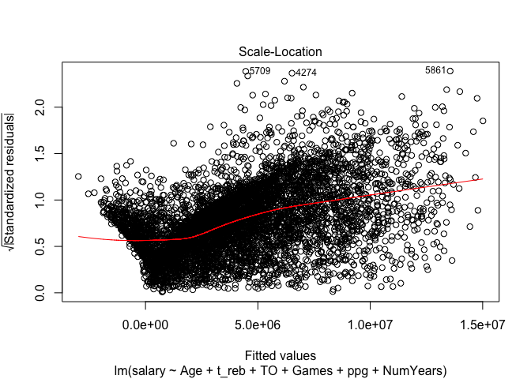<!-- -->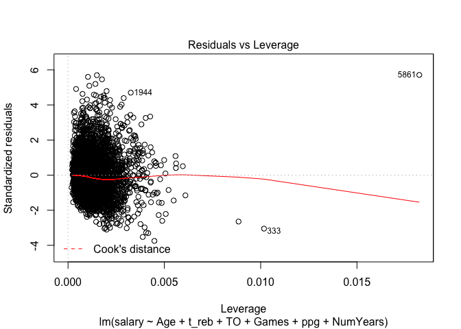<!-- -->

If we look at the residuals vs the fitted it still has the problem of Heterescedasticity in both of the models. 

###Box-cox transformation of variable to make it approximatly to a normal distribution. Will transform the salary variable(y variable)


```
## Box-Cox Transformation
## 
## 6161 data points used to estimate Lambda
## 
## Input data summary:
##     Min.  1st Qu.   Median     Mean  3rd Qu.     Max. 
##     2853  1071000  2535445  4195077  5632200 30453000 
## 
## Largest/Smallest: 10700 
## Sample Skewness: 1.74 
## 
## Estimated Lambda: 0.1 
## With fudge factor, Lambda = 0 will be used for transformations
```

```
## 
## Call:
## lm(formula = sal_new ~ Age + t_reb + Games + ppg + NumYears, 
##     data = nbaTrain)
## 
## Residuals:
##     Min      1Q  Median      3Q     Max 
## -6.1854 -0.4694  0.0460  0.5416  2.6711 
## 
## Coefficients:
##              Estimate Std. Error t value Pr(>|t|)    
## (Intercept) 1.085e+01  6.945e-02 156.170  < 2e-16 ***
## Age         8.517e-02  2.332e-03  36.522  < 2e-16 ***
## t_reb       8.529e-02  5.164e-03  16.516  < 2e-16 ***
## Games       3.072e-03  5.501e-04   5.583 2.46e-08 ***
## ppg         6.606e-02  2.379e-03  27.770  < 2e-16 ***
## NumYears    5.723e-02  2.877e-03  19.895  < 2e-16 ***
## ---
## Signif. codes:  0 '***' 0.001 '**' 0.01 '*' 0.05 '.' 0.1 ' ' 1
## 
## Residual standard error: 0.7911 on 6155 degrees of freedom
## Multiple R-squared:  0.5175,	Adjusted R-squared:  0.5171 
## F-statistic:  1320 on 5 and 6155 DF,  p-value: < 2.2e-16
```

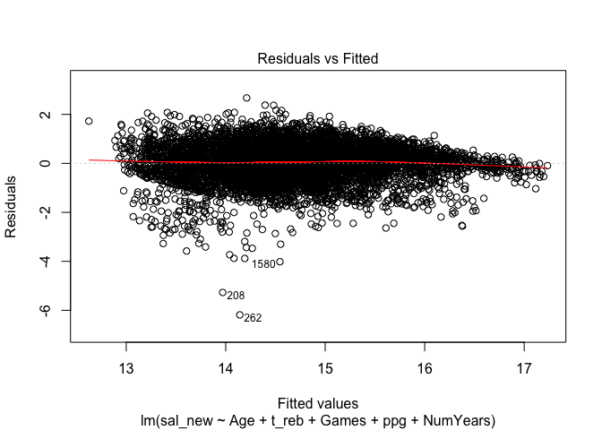<!-- -->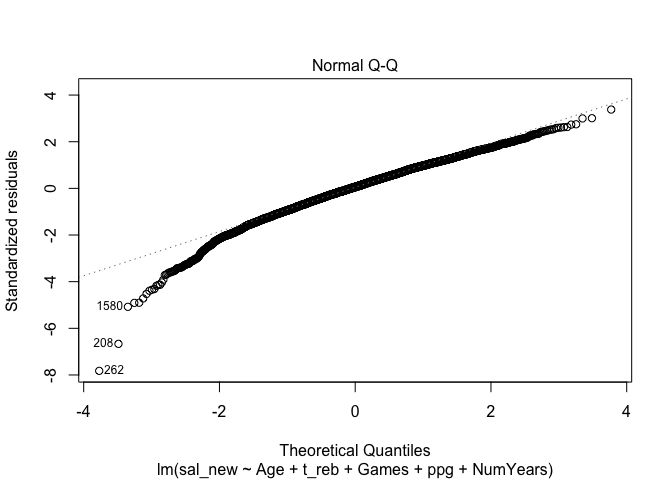<!-- -->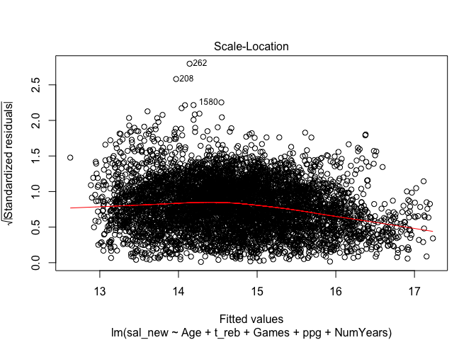<!-- -->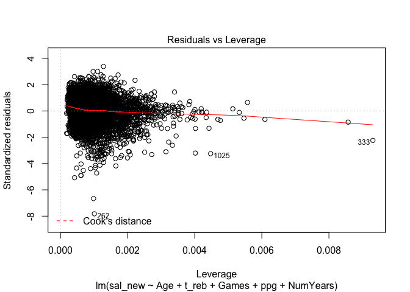<!-- -->

```
## [1] 0.7906648
```

```
## [1] 14.70151
```

The variation of observations around the regression line(the residual SE) in residuals vs fited look constant (homoscedasticity). Looking at the RMSE it is really low 0.79 compared to the mean of 14.7.

All assumptions are met now for a linear model 

    1.Y values are independent
    2.Y values can be expressed as a linear function of the X variable 
    3.Variation of observations around the regression line(the residual SE) is constant (homoscedasticity)
    4.For given value of X, Y values (or the error) are Normally distributed

###Testing the Box-Cox tranformation model to see how well it does with our test data. 


```
## Box-Cox Transformation
## 
## 1817 data points used to estimate Lambda
## 
## Input data summary:
##     Min.  1st Qu.   Median     Mean  3rd Qu.     Max. 
##    48028  1312611  3094013  5637083  7936509 34682550 
## 
## Largest/Smallest: 722 
## Sample Skewness: 1.61 
## 
## Estimated Lambda: 0.2
```

```
## [1] 0.0009297077
```

```
## [1] 85.24845
```

RMSE increased by a lot 0.79 to 85.24 and the R squared was much lower originally it was 0.5171 now it's 0.000929.  The training data does not do a good job of explaining the test data.  It would not be good to use newer data to predict older data.  However, the newer data seems to be on a whole new salary scale due to a major increase in basketball related income due to the tv deal which saw it increase from 930 mil to 2.6 billion.  And we can see this trend in our scatter plots where there is a huge increase in salary from 2015.   To be able to more accurately predict salary using statistics we would need to collect the 6 years of data going forward for the 2017 CBA.  Up till the 2023 CBA.  However, you would have a low number of observations of only 2700 observations. 
